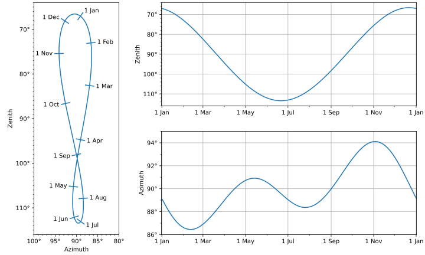
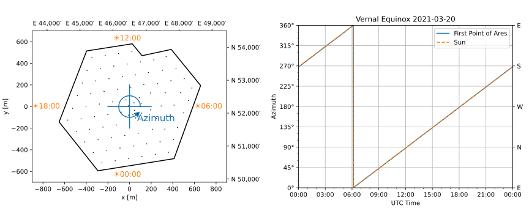

<!--
SPDX-FileCopyrightText: © 2022 IceCube Collaboration <https://icecube.wisc.edu/>

SPDX-License-Identifier: BSD-2-Clause
-->

[](https://results.pre-commit.ci/latest/github/icecube/i3astropy/main)
[](https://github.com/icecube/i3astropy/actions/workflows/unit_tests.yml)
[](https://codecov.io/gh/icecube/i3astropy)
[](https://opensource.org/licenses/BSD-2-Clause)

# i3astropy

Astropy support for the IceCube Coordinate System.

Astropy is an extensive software collection which includes routines to convert
between local and celestial coordinates. Because of IceCube's unique location
at the Geographic South Pole, it doesn't use the standard altitude/azimuth
coordinate system used by astropy and other astronomical software packages.
Instead IceCube uses a zenith/azimuth where the azimuth is defined with respect
to polar grid directions rather than the local meridian. IceCube's local
coordinate system is described in
[in the icetray documentation](https://docs.icecube.aq/icetray/main/projects/dataclasses/coordinates.html).
This python module provides a small extension to astropy with a class called
`i3astropy.I3Dir`, an instance of
[BaseCoordinateFrame](https://docs.astropy.org/en/stable/api/astropy.coordinates.BaseCoordinateFrame.html)
which can be used for all astropy coordinate transforms. In addition, a time
format is provided to allow IceCube DAQ times to be entered directly.
For more information on astropy coordinate transform see the
[astropy documentation](https://docs.astropy.org/en/stable/coordinates/index.html).

## Copying

Code in this repository is copyright © 2022 IceCube Collaboration <https://icecube.wisc.edu/>

Code in this repository is listened under the The 2-Clause BSD License (BSD-2-Clause). A copy is available in LICENSES/BSD-2-Clause.txt.

## Installation

To install with pip:

    pip install [--user] git+https://github.com/icecube/i3astropy.git

If you want to develop i3astropy you can install directly with flit.
The `-s` option will symlink the module into site-packages rather than copying it,
so that you can test changes without reinstalling the module:

    git clone git@github.com:icecube/i3astropy.git
    cd i3astropy
    flit install [--user] -s

## Tutorial

This example takes an event which occurred at DAQ time (2021, 155525688461058500) and was reconstructed in the direction of zenith = 0.73884 rad, azimuth = 2.7348 rad and converts it to RA and Dec.
In addition, get the Sun position in IceCube coordinates at the same time.

```python

>>> from astropy.coordinates import ICRS, get_sun
>>> from astropy.time import Time
>>> from astropy.units import radian
>>> from i3astropy import I3Dir

>>> # Create an astropy time from a daq time
>>> t = Time(2021, 155525688461058500, format="i3time")
>>> t.iso
'2021-06-30 00:09:28.846'

>>> # Convert IceCube coordinates to celestial
>>> I3Dir(zen=0.73884 * radian, az=2.7348 * radian, obstime=t).transform_to(ICRS())
<ICRS Coordinate: (ra, dec) in deg
    (213.61898984, -47.55991453)>

>>> # Convert Crab Nebula to IceCube coordinates
>>> ICRS("05h34m31.94", "+22d00m52.2").transform_to(I3Dir(obstime=t))
<I3Dir Coordinate (obstime=(2021, 155525688461058496)): (az, zen, r) in (deg, deg, )
    (286.7095864, 112.03182914, 1.)>

>>> # Get the Sun location in IceCube Coordinates
>>> get_sun(t).transform_to(I3Dir())
<SkyCoord (I3Dir: obstime=(2021, 155525688461058496)): (az, zen, r) in (deg, deg, )
    (271.46065373, 113.17296322, 1.)>

```

## Examples

[plot_analemma.py](./examples/plot_analemma.py) creates a diagram of the location of the Sun at noon
everyday for a year.



[plot_moon.py](./examples/plot_moon.py) plots the zenith of the moon over 252 lunar periods to show the
variation in altitude from orbit to orbit as the Moon's inclination changes relative to the equator.
Also shown is the maximum zenith for each Lunar cycle.


[plot_sun_azimuth.py](./examples/plot_sun_azimuth.py) plots the IceCube Azimuth of the Sun and First Point
of Ares on the Vernal Equinox next to a diagram of the IceCube detector with IceCube Azimuth labeled and
the positions of the sun at certain times. This Demonstrates that i3astropy is correctly orienting the
IceCube coordinate system.



[compare_ps_sample.py](examples/compare_ps_sample.py) takes a file from the Neutrino Sources Working
Group's datasets and calculate the Right Ascension and Declination of the events from the Zenith and
Azimuth and compare to the coordinates in the data file. It can be seen that i3astropy agrees with previous
methods to within 0.0002°, the high values for RA and azimuth are caused by events close to the pole.

```
Checked 10000 events
Max diff RA            : 0.000759°
Max diff dec           : 0.000173°
Max diff sky separation: 0.000174°
Max diff zenith        : 0.000173°
Max diff azimuth       : 0.000716°
Max diff I3 separation : 0.000174°
```
